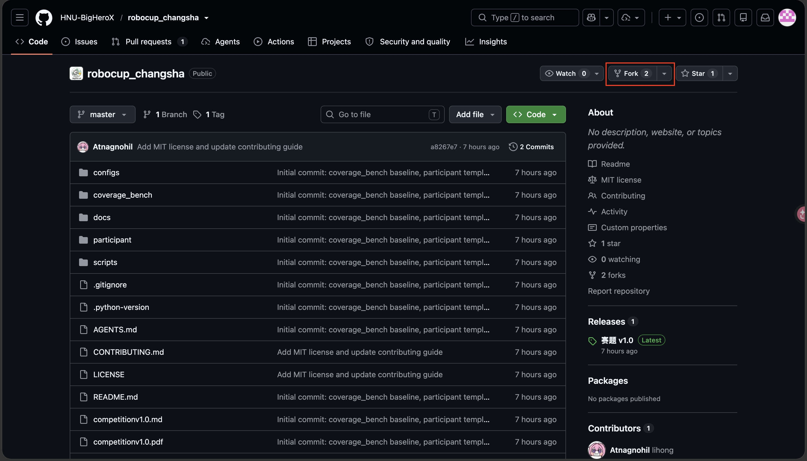
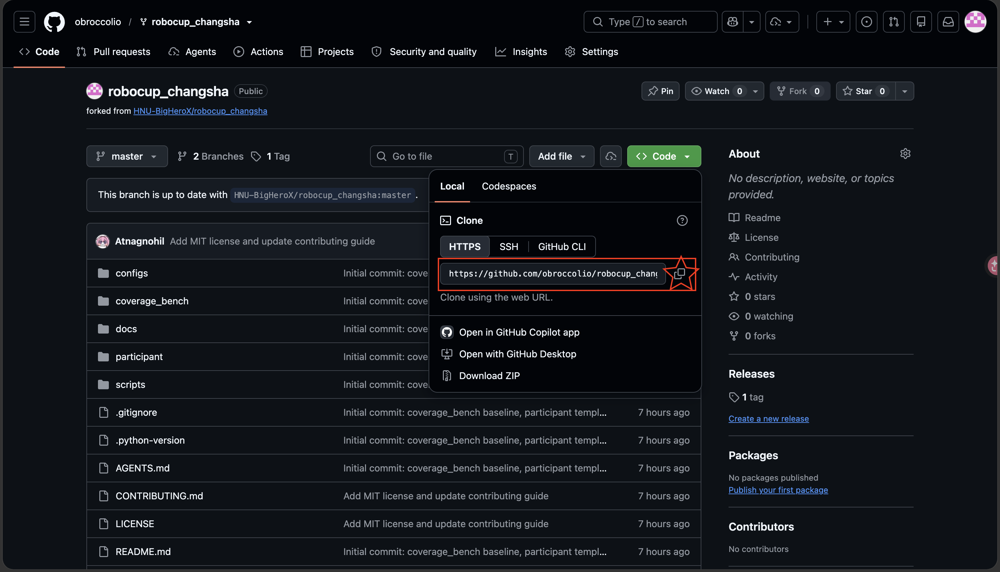

# 获取仓库并开始开发

本次比赛通过个人 Fork 保存参赛分支。先向组织方确认官方仓库地址、访问权限和自己的参赛编号。

下面用 `P017` 举例。请将它替换为自己的编号，并依次完成：确认编号 → Fork 并克隆仓库 → 检查并准备分支 → 创建本人目录 → 开发。

## Fork 并克隆仓库

打开组织方提供的官方仓库，点击 **Fork**，将仓库复制到自己的 GitHub 账户：



*图 1：在官方仓库页面点击 Fork。GitHub 的按钮位置或文字可能调整。*

完成后进入个人 Fork 页面，依次点击 **Code**、**HTTPS** 和地址右侧的复制按钮：



*图 2：在个人 Fork 页面复制 HTTPS 克隆地址。页面应显示该仓库 Fork 自官方仓库；实际复制的必须是个人 Fork 的地址。*

然后执行：

```sh
git clone https://github.com/<你的用户名>/<仓库名>.git
cd <仓库名>

git remote add upstream <官方仓库地址>
git remote -v

git fetch upstream
git switch -c P017 upstream/master
git push -u origin P017
```

将占位符换成自己的 GitHub 用户名、实际仓库名和组织方提供的官方仓库地址。本文后面的命令都在克隆后的仓库目录中执行。如果个人 Fork 已经在本地，直接进入仓库，不必再克隆一份；但仍要检查下面的远程配置。

克隆后先确认远程地址和当前状态，避免在错误的同名目录中操作：

```sh
git remote -v
git status --short
git branch --show-current
```

`origin` 应指向个人 Fork，`upstream` 应指向组织方提供的官方仓库。工作区状态不为空时，先弄清现有改动的来源；不要用重置、强制切换或删除文件的方式跳过这一步。

## 先准备编号分支

先查看当前改动和已有分支：

```sh
git status --short
git fetch upstream
git fetch origin
git branch --all
```

首次克隆、尚未创建编号分支时，输出可能类似：

```text
$ git branch --all
* master
  remotes/origin/HEAD -> origin/master
  remotes/origin/master
  remotes/upstream/master
```

这是示例输出，不要求颜色、空格或排列完全相同。重点是确认官方主线为 `upstream/master`，并检查本人编号分支是否已经存在于本地或个人 Fork（`origin`）。

工作区有尚未保存的改动时，先确认它们属于谁、应该保留在哪条分支，不要直接覆盖。首次参赛且本地、远程都没有 `P017` 分支时，从官方主线创建：

```sh
git switch -c P017 upstream/master
git push -u origin P017
```

如果本地已有本人分支，使用 `git switch P017`；如果只有远程存在，使用 `git switch --track origin/P017`。不要重复创建，也不要借用别人的编号。

用 `git branch --show-current` 确认当前是 `P017`，再进行下一步。后续需要功能分支时，先按 [Git 工作流程](git.md)准备好分支，再开始修改。

```text
$ git branch --show-current
P017
```

只要最后一行是本人的实际编号，就已经位于正确的编号分支；不要照抄示例中的 `P017`。

如果分支状态与预期不同，按下面的顺序判断：

1. `git branch --list P017` 检查本地是否已有本人分支。
2. `git branch --remotes --list origin/P017` 检查远程是否已有本人分支。
3. 两处都没有时才从官方主线 `upstream/master` 创建，并推送到 `origin`。
4. 两处都有但提交不同，先查看 `git log --oneline --decorate --graph --all`，不要直接覆盖远程历史。

示例编号只能用于说明命令。没有组织方确认的编号时，不要猜测、占用或复用已有编号。

## 创建本人目录

确认 `participant/P017/` 尚不存在，然后复制模板。已有本人目录时继续使用，不要用模板覆盖。

Windows PowerShell：

```powershell
Copy-Item -LiteralPath participant/_template -Destination participant/P017 -Recurse
```

Linux / macOS：

```sh
cp -R participant/_template participant/P017
```

复制完成后的目录结构应与下面的示例相近：

```text
participant/P017/
├── artifacts/
│   └── policy.npz
├── entry.py
├── train.py
├── submission.yaml
├── requirements-infer.lock
├── LOG.md
├── experiments.csv
├── REPORT.md
├── THIRD_PARTY.md
└── LICENSE
```

文件顺序不重要，但模板中的必需文件不能遗漏。后续增加的个人训练配置、导出脚本和辅助代码也应留在本人的编号目录内。

打开 `participant/P017/submission.yaml`，将 `participant_id` 改为自己的编号：

```yaml
participant_id: "P017"
```

模板已经带有示例模型和摘要。只修改编号时，不需要重算模型摘要；替换模型后则需要同步更新清单。

检查改动，再提交初始化结果：

```sh
git add participant/P017/
git diff --cached --stat
git commit -m "chore(P017): 初始化参赛目录"
git push -u origin P017
```

首次复制后，建议在提交前逐项确认：

- `participant/P017/` 是普通目录，不是符号链接或目录联接；
- `submission.yaml` 中只有编号发生了预期修改；
- 模板自带模型仍在 `artifacts/` 中；
- `git diff --cached --name-only` 只列出本人编号目录；
- 没有把 `_template/` 本身改掉，也没有加入虚拟环境、缓存或测试输出。

## 常见情况

### 已有本人目录，但没有本人分支

先停止写入，确认目录中的文件属于哪条分支、是否已经提交，以及它们是否需要保留。分支和工作归属确认前，不要再次复制模板，也不要移动现有目录。

### 已有本人分支，但目录还不存在

切换到本人分支并确认工作区干净，再按本文步骤复制模板。不要在官方主线上创建目录后再切分支。

### 复制后发现编号写错

在尚未开始开发时，先确认正确编号，再同时修正目录名和 `submission.yaml`。如果错误版本已经提交或推送，保留现场并联系组织方确认处理方式，避免擅自重写共享历史。

### `git switch` 提示会覆盖本地改动

这说明当前工作区有改动会受切换影响。先用 `git status --short` 和 `git diff` 确认内容及归属，再选择在正确分支提交或与组织方确认；不要强制切换。

## 接下来

按[使用指南](how_to_use.md)配置评测环境，先跑通模板。自己的策略、训练脚本、模型和报告都写在 `participant/P017/` 中。

开发期间可以随时推送本人分支。版本标签是可选的，最终提交需要在统一提交窗口内创建 PR，要求见[参与指南](../CONTRIBUTING.md)。窗口开放前，不得向比赛仓库之外的渠道发布比赛实现。
